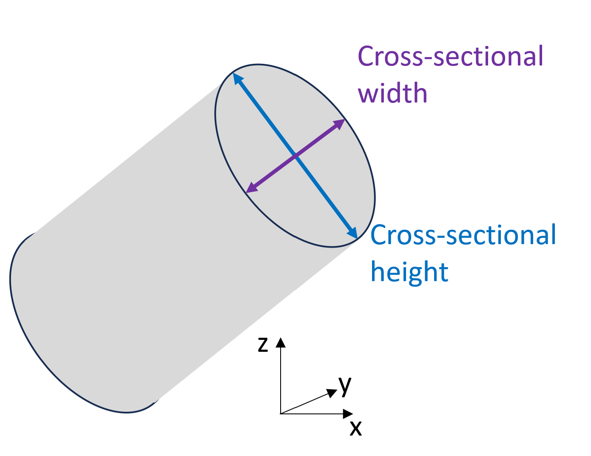

# KARST NETWORKS DATASETS FOR THE ERC-KARST PROJECT

This dataset regroups karst networks graph data.

We processed and cleaned cave survey data collected by cavers around the world. Cave survey were provided in a variety of format, which we trsnformed to Therion project, and then compiled the Therion project into SQL database. From this SQL database, we regroupe the identical stations, and rename the node ids. We then remove the duplicates and surface points, and add or remove links manually by visual inspection in 3D. When available we collecte conduit cross-sectional geometry (splays or left-right-up-down), or other flags.

The final result is a graph dataset, with a list of edges and nodes attributes. We describe bellow the list of files that can be found for each cave. Not all the files may be present.

## Example code to load data in python networkx

### link to jupyter notebook

### list of dictionnaries attached to the graph:
'csdim': list of 2 floats, [Width,Height] in m
'flag': list of strings, `ent`= entrance, `con` = continuation, `fix `= fixed, `spr` = spring, `sin`= sink, `dol`= doline, `dig` = dig, `air` =air-draught, `ove` = overhang, `arc` = arch attributes
'fulladdress': station name and path in the original folder - project
'idsql': station id in the sql database
'pos': list of 3 floats, [easting,northing,elevation], in specific coordinate system
'splays': list of list of 3 floats, [easting,northing,elevation]. each node can have multiple splays

## Cave list

| # | File Name     | Name              | Country  | Approximate Latitude (WSG84) | Approximate Longitude (WSG84) | Data coordinate system | Reference                                                                                                                                                                                      | Comments                           |
| --- | --------------- | ------------------- | :--------- | ------------------------------ | ------------------------------- | ------------------------ | ------------------------------------------------------------------------------------------------------------------------------------------------------------------------------------------------ | ------------------------------------ |
| 1 | GouffreDejaVu | Gouffre Déjà Vu | Chile    |                              |                               | local                  | Centre Terre. (2024).*Survey Data for the Ultima Patagonia Cave Exploration project* [Dataset]. [github.com/tr1813/ultima-patagonia-topo](https://github.com/tr1813/ultima-patagonia-topo)     |                                    |
| 2 | SystemMigovec | System Migovec    | Slovenia | 46.246                       | 13.765                        | EPSG:3794              | ICCC, & JSDPT. (2024).*Survey Data for the Tolminski Migovec Cave Exploration project* (2024.03.13) [Dataset]. Zenodo. [DOI: 10.5281/ZENODO.10813021](https://doi.org/10.5281/ZENODO.10813021) | Cave exploration is still ongoing. |
| 3 |               |                   |          |                              |                               |                        |                                                                                                                                                                                                |                                    |
| 4 |               |                   |          |                              |                               |                        |                                                                                                                                                                                                |                                    |
| 5 |               |                   |          |                              |                               |                        |                                                                                                                                                                                                |                                    |
| 6 | ReveEveille   | Rêve Eveillé    | Chile    | -50.064976                   | -75.159585                    | EPSG:32718             | Centre Terre. (2024).*Survey Data for the Ultima Patagonia Cave Exploration project* [Dataset]. [github.com/tr1813/ultima-patagonia-topo                                                       | Small linear cave                  |
| 7 |               |                   |          |                              |                               |                        |                                                                                                                                                                                                |                                    |
| 8 |               |                   |          |                              |                               |                        |                                                                                                                                                                                                |                                    |

## -50.064976

## Supporting file description

### `*_clean.3d`

3D visualisation of the clean dataset. .3D is the Aven data format. To visualize the file, install [Survex](https://fileexpert.net/engine/go.php?url=https://survex.com/screenshots.htmlhttps:/) (most simple installation) or [Therion](https://fileexpert.net/engine/go.php?url=https://therion.speleo.sk) (more complex).

### `*.sql`

SQL database of the project containing original compiled centerline data after loop closure (with or without splays). The data is compiled with Therion and the SQL file is created by the Therion compiler.

*Figure caption: SQL database description from the [Therion book](https://therion.speleo.sk/download.phphttps:/).*

### potential SQL station (node) flags:

`ent`= entrance, `con` = continuation, `fix `= fixed, `spr` = spring, `sin`= sink, `dol`= doline, `dig` = dig, `air` =air-draught, `ove` = overhang, `arc` = arch attributes

### potential SQL shot (edge) flags:

`dpl` = duplicate, `srf` = surface shots

## Clean database file description

### `*_edge.csv`

All the links between the nodes, after the cleaning process. Referes to the local node ID.

| Column | Name | Type | Units | Description                     |
| -------- | ------ | ------ | ------- | --------------------------------- |
| 1      | from | int  | -     | local node ID of edge departure |
| 2      | to   | int  | -     | local node ID of edge arrival   |

### `*_edge_flags.csv`

| Column | Name  | Type                    | Units | Description                                 |
| -------- | ------- | ------------------------- | ------- | --------------------------------------------- |
| 1      | from  | int                     | -     | local node ID of edge departure             |
| 2      | to    | int                     | -     | local node ID of edge arrival               |
| 3      | flags | string, list of strings | -     | any flags that can be attached to the edges |

### `*_edge_comments.csv`

| Column | Name     | Type                    | Units | Description                                    |
| -------- | ---------- | ------------------------- | ------- | ------------------------------------------------ |
| 1      | from     | int                     | -     | local node ID of edge departure                |
| 2      | to       | int                     | -     | local node ID of edge arrival                  |
| 3      | comments | string, list of strings | -     | any comments that can be attached to the edges |

### `*_node_pos.csv`

| Column | Name | Type  | Units | Description                                |
| -------- | ------ | ------- | ------- | -------------------------------------------- |
| 1      | id   | int   | -     | local node ID                              |
| 2      | x    | float | m     | coordinates in the x direction (easting)   |
| 3      | y    | float | m     | coordinates in the y direction (northing)  |
| 4      | z    | float | m     | coordinates in the z direction (elevation) |

### `*_node_csdim.csv`

| Column | Name      | Type  | Units | Description            |
| -------- | ----------- | ------- | ------- | ------------------------ |
| 1      | from      | int   | -     | local node ID          |
| 2      | cs_width  | float | m     | cross-sectional width  |
| 3      | cs_height | float | m     | cross-sectional height |

### `*_node_flags.csv`

| Column | Name     | Type                        | Units | Description                    |
| -------- | ---------- | ----------------------------- | ------- | -------------------------------- |
| 1      | id       | int                         | -     | local node ID                  |
| 3      | comments | string, list of stringsfloa | -     | any flags attached to the node |

### `*_node_comments.csv`

| Column | Name     | Type                    | Units | Description                       |
| -------- | ---------- | ------------------------- | ------- | ----------------------------------- |
| 1      | from     | int                     | -     | local node ID                     |
| 3      | comments | string, list of strings | -     | any comments attached to the node |

### `*_node_splays.csv`

| Column | Name | Type  | Units | Description                                                              |
| -------- | ------ | ------- | ------- | -------------------------------------------------------------------------- |
| 1      | id   | int   | -     | local node ID of the origin of the splay shot                            |
| 2      | x    | float | m     | coordinates in the x direction of the point of arrival of the splay shot |
| 3      | y    | float | m     | coordinates in the y direction of the point of arrival of the splay shot |
| 4      | z    | float | m     | coordinates in the z direction of the point of arrival of the splay shot |

### `*_node_idsql.csv`

| Column | Name  | Type | Units | Description   |
| -------- | ------- | ------ | ------- | --------------- |
| 1      | id    | int  | -     | local node ID |
| 2      | idsql | int  | -     | SQL node ID   |

### `*_node_fulladdress.csv`

| Column | Name        | Type   | Units | Description                                   |
| -------- | ------------- | -------- | ------- | ----------------------------------------------- |
| 1      | id          | int    | -     | local node ID                                 |
| 2      | fulladdress | string | -     | original data id and full address of the node |

## Flags description

### edge flags:

* `manual_input`: edges added based on visual observation of the graph during the cleaning process
* ...

### node flags:

* `con`: continuation, cavers identified this last point of a survey session as potentially leading futher
* `ent`: entrance, points where the cave intersect with the surface
* `inl`: inlet, points with water input from a un-surveyed side passage (note: will be displayed in sketch)
* `oul`: outlet, points with water output towards a un-surveyed side passage (note: will be displayed in sketch)
* `spr`: spring,
* `sin`: sink, position inside or at the end of a passage where water is exiting through the ground or the wall.
* `wtf`: position at the top or inside a wall where water can or is falling
* `smp`: sump
* `str`: position where a stream is present in the conduit

## Cross-sectional dimension measurements and processing

### Type of dimension measurements:

#### LRUD (left, right, up, down)

Figure: Left,Right,Up,Down description from Toporobot manuel (add citation)

#### Splay shots

### Cross-sectional dimension description

