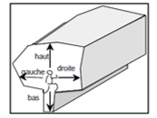
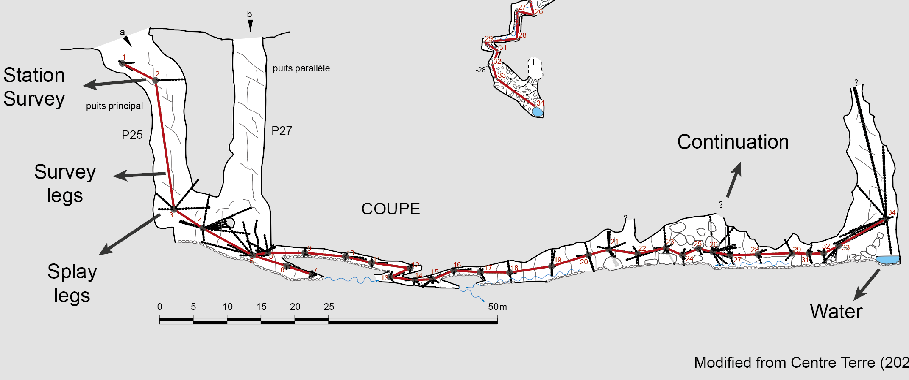
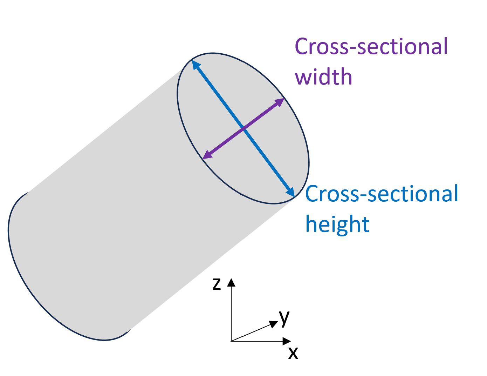

## Cross-sectional dimension measurements and processing

### Type of dimension measurements:

#### LRUD (left, right, up, down)

Figure: Left,Right,Up,Down description from Toporobot manuel (add citation)

#### Splay shots

### Cross-sectional dimension description

