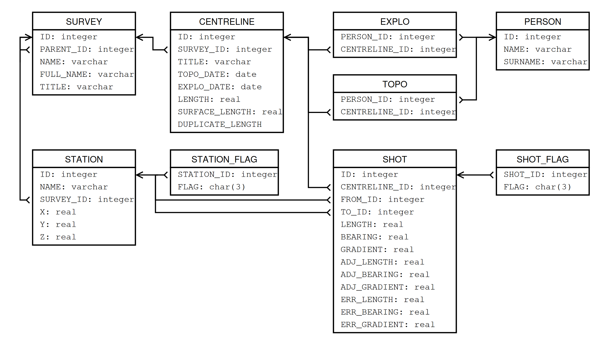

### `*.sql`

SQL database of the project containing original compiled centerline data after loop closure (with or without splays). The data is compiled with Therion and the SQL file is created by the Therion compiler.

*Figure caption: SQL database description from the [Therion book](https://therion.speleo.sk/download.phphttps:/).*

#### potential SQL station (node) flags:

`ent`= entrance, `con` = continuation, `fix `= fixed, `spr` = spring, `sin`= sink, `dol`= doline, `dig` = dig, `air` =air-draught, `ove` = overhang, `arc` = arch attributes

#### potential SQL shot (edge) flags:

`dpl` = duplicate, `srf` = surface shots